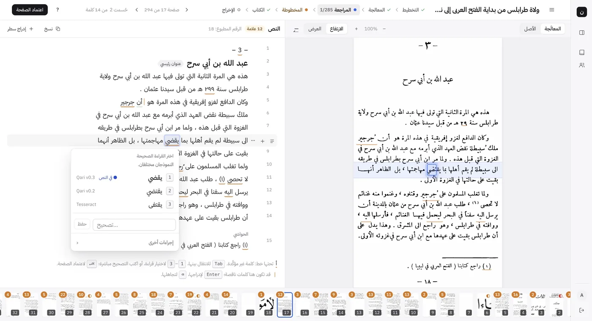
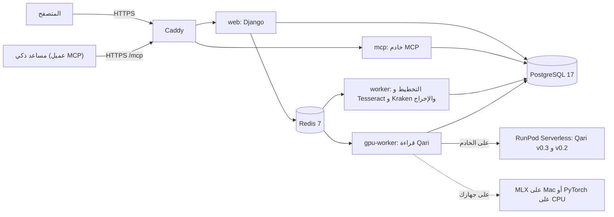

# نسّاخ (Nassakh)

نسّاخ يحوّل الكتاب العربي المطبوع الممسوح (PDF) إلى نص مراجَع، كل كلمة فيه مربوطة بموضعها في صورة الصفحة. الناشر يُخرج من هذا النص طبعة جديدة. الباحث والمساعد الذكي يبحثان فيه ويتحققان من الاقتباس.

- **الموقع الحي:** https://nassakh.tech
- **التحدي:** تحدي الذكاء الاصطناعي في خدمة المحتوى الإسلامي 2026، المسار 04: أدوات المعرفة والتحقق لتمكين المعرّفين بالإسلام.
- **ما يُقيَّم:** ما بُني من 4 إلى 6 أكتوبر 2026. انظر [ما أنجز في أيام التحدي](#ما-أنجز-في-أيام-التحدي).



> **للتجربة في 5 دقائق:** [التجربة على الموقع الحي](#التجربة-على-الموقع-الحي)
>
> **للتشغيل على جهازك:** [التشغيل على جهازك](#التشغيل-على-جهازك)

## المحتويات

1. [المشكلة والحل](#المشكلة-والحل)
2. [ما الذي يفعله نسّاخ](#ما-الذي-يفعله-نسّاخ)
3. [ما أنجز في أيام التحدي](#ما-أنجز-في-أيام-التحدي)
4. [التجربة على الموقع الحي](#التجربة-على-الموقع-الحي)
5. [التشغيل على جهازك](#التشغيل-على-جهازك)
6. [البنية والتقنيات](#البنية-والتقنيات)
7. [القياس والنتائج](#القياس-والنتائج)
8. [الموثوقية والحقوق والمصادر](#الموثوقية-والحقوق-والمصادر)
9. [القيود المعروفة](#القيود-المعروفة)
10. [الاختبارات](#الاختبارات)
11. [هيكل المستودع](#هيكل-المستودع)
12. [الترخيص](#الترخيص)
13. [المصطلحات](#المصطلحات)
14. [English summary](#english-summary)
15. [التواصل](#التواصل)

## المشكلة والحل

**المشكلة.** كتب إسلامية كثيرة ما زالت صورًا لا تُقرأ آليًا. هي كتب في الملك العام لم تدخل المكتبات الرقمية، ولا توجد إلا صورًا ممسوحة لطبعات قديمة. تفريغها باليد يأخذ شهورًا، ولا يخلو من الخطأ. لذلك ينقل الباحثون والمساعدات الذكية منها بالواسطة أو من الذاكرة. والنتيجة اقتباسات محرّفة، وإحالات خاطئة، وكلام المحقق يُنسب إلى المؤلف.

**الحل.** سلسلة واحدة تخدم الناشر والباحث:

- **طرف الناشر والمحقق:** نماذج عربية للتعرّف الضوئي على الحروف (OCR) تقرأ الصفحة. المختص يراجع الكلمات المشكوك فيها على صورتها. الناشر يُخرج من النص المراجَع طبعة ورقية أو رقمية.
- **طرف الباحث والمساعد الذكي (AI assistant):** يبحثان في النص نفسه، ويتحققان من الاقتباس، ويرجعان إلى الصفحة المطبوعة. أي مساعد يدعم بروتوكول MCP (Model Context Protocol) يتصل بنسّاخ مباشرة.

مراجعة واحدة ينتفع بها الطرفان. النص الذي يطبعه الناشر هو النص الذي يستشهد به الباحث.

## ما الذي يفعله نسّاخ

### طرف الناشر: ست مراحل من الصورة إلى الطبعة

| المرحلة | ما يحدث فيها | التطبيق في الشفرة |
|---|---|---|
| التخطيط | تحديد آلي لمناطق الصفحة: المتن والحاشية والترويسة ورقم الصفحة. المستخدم يعدّلها إن لزم. | `processing` |
| المعالجة | نموذجا Qari v0.3 وv0.2 يقرآن كل منطقة. عند اختلافهما يُرجَّح بينهما، وتُعلَّم الكلمة بالشك. Tesseract وKraken يحددان مواضع الكلمات. Kraken يقرأ الأرقام وأرقام الحواشي. | `ocr` |
| المراجعة | المختص يحسم كل كلمة مشكوك فيها أمام صورتها، ثم يعتمد الصفحة. | `review` |
| المخطوطة | تجميع الكتاب آليًا: حذف الترويسات وأرقام الصفحات، ووصل الفقرات، وربط الحواشي بإحالاتها. ثم مراجعة الفقرات والفصول. | `assembly`، `editor` |
| الكتاب | تنسيق الطبعة الجديدة، والأصل المطبوع بجانبها. | `editor` |
| الإخراج | PDF للمطبعة، وPDF للشاشة، وWord، وEPUB. | `publishing` |

هذه المراحل الست موجودة في [نسخة البداية](docs/CHALLENGE_BASELINE.md). لم تُبنَ في أيام التحدي.

### طرف الباحث: البحث والتحقق من الاقتباس

صفحة «البحث والتحقق» تعمل على النص كما رُوجع على صورة الصفحة، لا على نص الطبعة المحرَّر.

- **البحث:** في المتن، أو في الحواشي، أو فيهما. يتجاوز البحث فروق الرسم والتشكيل، مثل الهمزات والتاء المربوطة والحركات (التطبيع، normalisation).
- **التحقق من الاقتباس:** يقابل النص المنقول بنص الكتاب كلمةً كلمة. يعطي واحدًا من أربعة أجوبة:

| الجواب | المعنى |
|---|---|
| مطابق | النص كما في الكتاب. إذا اختلفت الحركات وحدها، يذكر ذلك ولا يعدّه خطأ. |
| مختلف | الفرق في كلمة مراجَعة أو مقروءة بثقة. يعرض كل فرق، وكلمة الكتاب بجانب كلمة النص المنقول. |
| يحتاج مطابقة مع الصورة | الفرق في كلمة لم تُحسم قراءتها بعد. قد يكون الخطأ في القراءة لا في الاقتباس. لا يصف النص بالتحريف، ويعرض صورة الأسطر. |
| لم يوجد | النص ليس في كتب الحساب. لا يقول إن النص مختلَق. |

- **الصفحة المطبوعة:** كل نتيجة تذكر رقم الصفحة في الطبعة المطبوعة إذا عُرف. إذا لم يُعرف، تذكر رقم صفحة المسح. ومعها رابط إلى صورة الأسطر، والموضع مظلَّل. الرابط موقَّع، ويعمل بلا تسجيل دخول مدة 7 أيام.
- **المؤلف أم المحقق:** المتن والحواشي مفهرسان كلٌّ على حدة. إذا نُسبت عبارة من الحاشية إلى المؤلف، ينبّه نسّاخ: «هذا من حاشية المحقق لا من متن المؤلف». والعكس كذلك.
- **الإحالة:** «نسخ الإحالة» يعطي إحالة جاهزة: المؤلف، والعنوان، والمحقق، والناشر، والطبعة، والسنة، والصفحة.

### خادم MCP

نسّاخ لا يضيف مساعد محادثة من عنده. أي مساعد ذكي يدعم MCP يتصل بخادم MCP (MCP server) في نسّاخ، ويقرأ كتب حسابه فقط.

| الأداة | ما تفعله |
|---|---|
| `list_books` | تعرض كتب الحساب: العنوان والمؤلف والمحقق والطبعة وعدد الصفحات ونسبة الأسطر المراجَعة. |
| `search` | تبحث في المتن أو الحواشي أو فيهما. |
| `get_passage` | تجلب المقطع: المتن والحواشي منفصلين، والصفحة المطبوعة، وحالة كل كلمة، ورابط صورة الأسطر. |
| `verify_quote` | تتحقق من الاقتباس، وتعطي أحد الأجوبة الأربعة، وتنبّه إلى خطأ النسبة. |
| `cite` | تبني الإحالة الموثّقة. |

- العنوان: `https://nassakh.tech/mcp`، بنقل Streamable HTTP.
- الأدوات للقراءة فقط. لا تغيّر شيئًا في الكتب.
- الدخول بمفتاح وصول (access key) يُنشأ من صفحة «ربط مساعد» ويُلغى منها. المفتاح يُرسل في ترويسة `Authorization: Bearer`، أو في رابط سري للعملاء الذين يقبلون رابطًا فقط.
- الحد: 60 استدعاء في الدقيقة لكل مفتاح. كل استدعاء يُسجَّل.
- صفحة «ربط مساعد» تعرض خطوات الربط لكل من: Claude (الموقع وتطبيق سطح المكتب)، وChatGPT، وClaude Code، وCursor، وVS Code، وأي عميل MCP آخر.
- جُرّب الربط من Claude وChatGPT، من صفحات إعداداتهما، في 6 أكتوبر 2026. يعمل.

## ما أنجز في أيام التحدي

بُني نسّاخ على مشروع سابق، كما يسمح البند 8 من شروط التحدي. وُثّقت نسخة البداية مساء 3 أكتوبر 2026 في [docs/CHALLENGE_BASELINE.md](docs/CHALLENGE_BASELINE.md)، وعليها الوسم (tag) `challenge-baseline-2026-10-03`. كل إيداع بعد هذا الوسم هو عمل أيام التحدي.

- الفرق كاملًا في git: [`challenge-baseline-2026-10-03...main`](../../compare/challenge-baseline-2026-10-03...main)
- الشفرة عند نسخة البداية: [`challenge-baseline-2026-10-03`](../../tree/challenge-baseline-2026-10-03)
- مواصفة العمل: [docs/CHALLENGE_SPEC.md](docs/CHALLENGE_SPEC.md). القرارات: D106 إلى D112 في [docs/DECISIONS.md](docs/DECISIONS.md).

| الجزء | نسخة البداية (قبل 4 أكتوبر) | أيام التحدي (4 إلى 6 أكتوبر) |
|---|---|---|
| قراءة الكتاب وإخراجه | المراحل الست كاملة: التخطيط، والمعالجة، والمراجعة، والمخطوطة، والكتاب، والإخراج | لم تتغيّر |
| الحسابات | مؤسسات فقط. كل كتاب لا يراه إلا أعضاء مؤسسته | تسجيل مفتوح لمؤسسة أو لفرد، وتأكيد بالبريد، والبريد اسم الدخول (D106) |
| رصيد الصفحات | لا يوجد | رصيد صفحات لكل حساب، وباقات، وسجل حركة لا يُعدَّل، وصفحة «الفوترة» للإدارة (D106) |
| البحث | لا يوجد | بحث في المتن والحواشي مع تطبيع عربي، وفهرس يتجدد مع كل مراجعة (D107) |
| التحقق من الاقتباس | لا يوجد | الأجوبة الأربعة، والفروق كلمةً كلمة، وتنبيه النسبة إلى المؤلف أو المحقق (D107) |
| الصفحة المطبوعة والإحالة | لا يوجد | رقم الصفحة المطبوعة، ورابط موقَّع لصورة الأسطر، والإحالة الجاهزة (D107) |
| صفحة «البحث والتحقق» | لا توجد | البحث، والتحقق من نص مع «جرّب مثالًا»، وربط مساعد (D107) |
| خادم MCP | لا يوجد | خمس أدوات للقراءة فقط، ومفاتيح وصول، ورابط سري، وحد للاستدعاءات (D108) |
| التشغيل | على جهاز Mac للمطوّر. النماذج على Mac أو على RunPod | خادم عام بـ Docker Compose وCaddy وHTTPS على https://nassakh.tech، ونسخ احتياطي ليلي، ومراقبة كل 5 دقائق (D111) |
| كتب التجربة | على جهاز المطوّر | نقل الكتب المقروءة بين قواعد البيانات حزمةً واحدة (D110)، وحساب تجربة للمحكّمين |
| صفحة التعريف | لا توجد | صفحة عامة على `/` |
| القياس | لا قياس للتحقق من الاقتباس | `manage.py research_eval`، ومقارنة ببديل مسمّى، ونتائج منشورة (D112) |
| التوثيق | وثائق التطوير الداخلية | هذا الملف، وأدلة التشغيل، وسجل التراخيص والمصادر (6 أكتوبر) |

## التجربة على الموقع الحي

الموقع: **https://nassakh.tech**. في حساب التجربة ثلاثة كتب مقروءة:

| الكتاب | الصفحات |
|---|---|
| ولاة طرابلس من بداية الفتح العربي إلى نهاية العهد التركي | 294 |
| مختصر صحيح البخاري (من الصفحة 31 إلى 150) | 120 |
| تاريخ ليبيا العام | 196 |

> **تنبيه:** بيانات الدخول لحساب التجربة في نموذج التسليم فقط. لا تُكتب في هذا المستودع.
>
> **تنبيه:** حساب التجربة مشترك بين المحكّمين. لا تحذف كتابًا. لا تضغط «إعادة المعالجة».

**ما تفعله في 5 دقائق:**

1. افتح https://nassakh.tech، واضغط «تسجيل الدخول».
2. أدخل البريد وكلمة المرور من نموذج التسليم.
3. افتح كتاب «ولاة طرابلس» من قائمة الكتب.
4. اختر «المراجعة» من شريط المراحل في أعلى الصفحة.
5. اضغط كلمة مسطَّرة لترى قراءات النماذج وصورة موضعها.
6. افتح «البحث والتحقق» من الشريط الجانبي.
7. اكتب كلمة في «البحث»، مثل «طرابلس»، واضغط «بحث».
8. افتح «التحقق من نص»، واضغط «جرّب مثالًا». يظهر الجواب «مطابق».
9. ضع كلمة أخرى مكان كلمة في النص المنقول، واضغط «تحقّق». يظهر الجواب «مختلف»، ومعه موضع الكلمة.
10. اضغط «فتح الصورة» لترى الأسطر في الصفحة المطبوعة.

**ربط مساعد ذكي (اختياري، 5 دقائق أخرى):**

> **تنبيه:** المفتاح يظهر مرة واحدة فقط. الرابط السري يعمل عمل كلمة المرور. لا تنشره.

1. افتح «ربط مساعد» في صفحة «البحث والتحقق».
2. اكتب اسمًا للاتصال، واضغط «إنشاء المفتاح».
3. اختر عميلك، واتبع الخطوات المعروضة.
4. اسأل المساعد عن عبارة من أحد الكتب، واطلب منه التحقق منها.

**إنشاء حساب جديد:** التسجيل مفتوح لمؤسسة أو لفرد. الحساب يعمل بعد تأكيد البريد. الحساب الجديد يبدأ برصيد 0 صفحة، فلا يستطيع رفع كتاب حتى تمنحه إدارة المنصة صفحات.

## التشغيل على جهازك

لتشغيل نسّاخ على جهازك طريقان. كلاهما يقرأ الصفحات بالنموذجين نفسيهما: Qari v0.3 وQari v0.2. الخطوات الكاملة المجرَّبة، مع حل المشكلات، في [docs/RUN_LOCALLY.md](docs/RUN_LOCALLY.md).

كتاب العيّنة: [samples/alwaraqat-sample.pdf](samples/alwaraqat-sample.pdf). هو صفحتان من أول «الورقات» للجويني، نص في الملك العام. صور الصفحتين مولَّدة بشكل المسح، وليست مسحًا حقيقيًا ([samples/README.md](samples/README.md)).

| | (أ) Mac بمعالج Apple Silicon مع MLX | (ب) أي حاسوب مع Docker على المعالج (CPU) |
|---|---|---|
| الجهاز | Mac بشريحة M1 أو أحدث | Linux، أو Windows، أو Mac بمعالج Intel، مع Docker |
| تشغيل النماذج | MLX على المعالج الرسومي في Mac (`OCR_BACKEND=mlx`) | PyTorch على المعالج (CPU) داخل حاوية (container) (`OCR_BACKEND=torch`) |
| الذاكرة (RAM) | 16 GB أو أكثر (جُرّب على 24 GB) | 16 GB أو أكثر، منها 12 GB لـ Docker |
| مساحة القرص | نحو 25 GB | نحو 20 GB |
| التنزيل | 9 GB للنماذج، ونحو 1.5 GB لحزم Python | 9 GB للنماذج، ونحو 2 GB للصور (images) |
| زمن الصفحة | نحو 20 ثانية (الصفحة الأولى حتى دقيقتين) | نحو 6 إلى 8 دقائق على نواتين (تقدير) |
| حالة التجربة | جُرّب كاملًا في 6 أكتوبر 2026 | جُرّب بناء الصورة، وتنزيل النماذج، وقراءة صفحة. لم يُجرَّب تشغيل الخدمات كلها معًا |

> **تنبيه:** القراءة على المعالج (CPU) بطيئة. جرّب كتاب العيّنة أولًا، لا كتابًا كاملًا. على Mac بمعالج Apple Silicon، استعمل الطريق (أ).
>
> **تنبيه:** الخادم العام يستعمل طريقًا ثالثًا هو `runpod`. هذا الطريق يحتاج عامل GPU خاصًا ليس في هذا المستودع. لا تستعمله هنا.

### (أ) Mac مع MLX

1. ثبّت الأدوات بـ Homebrew:

   ```sh
   brew install uv redis tesseract tesseract-lang postgresql@17
   brew services start postgresql@17
   brew services start redis
   export PATH="$(brew --prefix postgresql@17)/bin:$PATH"
   ```

2. انسخ المستودع، وثبّت حزم Python:

   ```sh
   git clone <repository URL> nassakh && cd nassakh
   uv venv --python 3.13 .venv
   uv pip install --python .venv/bin/python -r pyproject.toml --extra dev --extra mlx
   ```

3. ثبّت Kraken في بيئته الخاصة (Python 3.11):

   ```sh
   make kraken
   ```

4. انسخ ملف الإعدادات: `cp .env.example .env`. غيّر فيه هذه الأسطر:

   ```ini
   SECRET_KEY=<a long random string, e.g. from: openssl rand -hex 32>
   DATABASE_URL=postgres://localhost:5432/nassakh
   OCR_BACKEND=mlx
   OCR_MODELS_DIR=models/qari
   ```

5. أنشئ قاعدة البيانات: `make db`.
6. نزّل النماذج وجهّزها (9 GB):

   ```sh
   .venv/bin/python manage.py prepare_models --mlx
   ```

7. شغّل نسّاخ. افتح ثلاث نوافذ (terminals)، وشغّل أمرًا في كل نافذة:

   ```sh
   make web          # the site on http://127.0.0.1:8000
   make worker       # ingest, layout, Tesseract, Kraken, exports
   make gpu-worker   # the two Qari models, loaded once (about 9 GB of memory)
   ```

8. أنشئ أول مستخدم: `make superuser`. اكتب بريدك في `Username` وفي `Email address`. البريد هو اسم الدخول.
9. افتح http://127.0.0.1:8000، وسجّل الدخول. ارفع كتاب العيّنة، واضغط «استخراج الصفحات»، ثم «بدء المعالجة».

في التجربة على نسخة جديدة من المستودع: ظهر نص الصفحتين بعد 65 ثانية من «بدء المعالجة».

### (ب) Docker على المعالج (CPU)

1. ثبّت Docker. في Docker Desktop، اجعل الذاكرة (Memory) 12 GB أو أكثر.
2. انسخ المستودع، وانسخ ملف الإعدادات المحلي:

   ```sh
   git clone <repository URL> nassakh && cd nassakh
   cp deploy/.env.local.example deploy/.env.local
   ```

3. افتح `deploy/.env.local`. ضع في `SECRET_KEY` نصًا عشوائيًا طويلًا.
4. ابنِ الصورة (image)، ونزّل النماذج (9 GB)، وشغّل الخدمات:

   ```sh
   docker compose -f docker-compose.local.yml build
   docker compose -f docker-compose.local.yml run --rm --no-deps gpu-worker python manage.py prepare_models
   docker compose -f docker-compose.local.yml up -d
   docker compose -f docker-compose.local.yml exec web python manage.py createsuperuser
   ```

5. افتح http://localhost:8000، وسجّل الدخول. خادم MCP على http://localhost:8001/mcp.
6. ارفع كتاب العيّنة كما في الطريق (أ)، الخطوة 9.

القياس على خادم بنواتين وذاكرة 7 GB: قراءة صفحة العيّنة بنموذج واحد أخذت نحو 168 ثانية (2.7 وحدة نصية (token) في الثانية). الصفحة الكاملة تُقرأ بنموذجين، فتأخذ نحو 6 إلى 8 دقائق (تقدير).

## البنية والتقنيات



| المكوّن | الاستعمال |
|---|---|
| Django 6.1 وDjango REST framework | التطبيق والواجهات البرمجية (API) |
| Celery مع Redis | طوابير المهام (task queues): `default` و`layout` و`export` على المعالج، و`gpu` لقراءة النماذج |
| PostgreSQL 17 | قاعدة البيانات، مع فهرس `pg_trgm` للبحث |
| Qari-OCR v0.3 وv0.2 (NAMAA) على Qwen2-VL-2B-Instruct | قراءة الصفحة، والترجيح بين النموذجين |
| Tesseract 5 (العربية) | مواضع الكلمات، وقراءة احتياطية |
| Kraken مع نموذج `all_arabic_scripts` من OpenITI | الأرقام، وأرقام الحواشي، ومواضع الكلمات في الأسطر |
| MLX-VLM أو PyTorch | تشغيل نموذجَي Qari على الجهاز المحلي |
| RapidFuzz | المطابقة التقريبية في البحث |
| MCP Python SDK (الحزمة الرسمية `mcp`) | خادم MCP بنقل Streamable HTTP |
| WeasyPrint وpython-docx وEbookLib | إخراج PDF وWord وEPUB |
| Alpine.js وTailwind CSS وTiptap | الواجهة والمحرّر |

**التشغيل على الخادم العام** ([docs/DEPLOY.md](docs/DEPLOY.md)، [تقرير النشر](docs/DEPLOY_REPORT_2026-10-05.md)):

- خادم افتراضي واحد (VPS): 4 معالجات افتراضية، وذاكرة 16 GB، ونظام Ubuntu.
- Docker Compose يشغّل: `caddy`، و`web`، و`worker`، و`gpu-worker`، و`mcp`، و`postgres`، و`redis`. الملف: [docker-compose.yml](docker-compose.yml).
- Caddy يقدّم HTTPS بشهادة Let's Encrypt. لا يكتب الرابط السري لخادم MCP في السجلات.
- قراءة النماذج على RunPod Serverless بمعالج رسومي (GPU) سعة 24 GB. في اختبار النشر قُرئت 114 صفحة بلا أي استدعاء فاشل.
- عامل RunPod (RunPod worker) الذي يشغّل النموذجين ليس جزءًا من هذا المستودع.
- نسخة احتياطية ليلية لقاعدة البيانات. ومراقبة كل 5 دقائق تعيد تشغيل الخدمة المتوقفة.

## القياس والنتائج

قسنا أداة التحقق من الاقتباس على ثلاثة كتب مقروءة: 569 صفحة، و82,788 كلمة. صنعنا 1,980 عبارة في 11 صنفًا، بثلاث بذور (seeds) عشوائية، ثم 2,340 عبارة أخرى لفحص الطول ودرجة التغيير. البديل المسمّى هو البحث الحرفي في النص الخام، أي ما يفعله Ctrl+F في ملف PDF.

| ما قيس (عبارات من 8 إلى 14 كلمة) | نسّاخ | البحث الحرفي (Ctrl+F) | حدود النتيجة |
|---|---|---|---|
| عبارة صحيحة مكتوبة بإملاء الناس (بلا تشكيل، و«أ» «ا»، و«ة» «ه»): قُبلت | 100% | 0% | العبارات مقصوصة من نص OCR نفسه، فالقبول صحيح بحكم الصنع إلى حد كبير. |
| كلمة مبدَّلة أو محذوفة أو مقدَّمة: كُشفت وحُدّد موضعها | 100% | يقول «لم يوجد» ولا يحدد الموضع | التعديلات اصطناعية. إذا تبدّلت 4 كلمات، يقول نسّاخ «لم يوجد» في 32% من الحالات. |
| حاشية نُسبت إلى المؤلف، أو متن نُسب إلى المحقق: كُشفت النسبة | 100% | 0% | ثلاثة كتب فقط، بخط مطبوع متقارب. |
| عبارة صحيحة اختلفت عند كلمة مشكوك فيها: اتُّهمت بالتحريف (الأقل أفضل) | 0.6% | 100% | الصنف مبني على الصنع. أثره في الاقتباس الحقيقي غير مقيس. |
| عبارة ليست في الكتب: الجواب «لم يوجد» | 99.4% | 100% | نسّاخ أضعف هنا. في العبارات من 4 أو 5 كلمات: 93.9%. |

- **التكرار:** أعدنا البذرة الأولى. الأجوبة متطابقة في 1,440 من 1,440 عبارة.
- **السرعة:** الوسيط 44 ms، والمئين 95 هو 111 ms، على جهاز التطوير.
- **لا مجموعة موسومة باليد.** لم نقارن ببحث بالتضمين (embeddings) ولا بنموذج لغوي يُسأل عن الاقتباس.

الجداول الكاملة والإخفاقات وكل الحدود: [docs/CHALLENGE_RESULTS.md](docs/CHALLENGE_RESULTS.md). المنهجية: D112 في [docs/DECISIONS.md](docs/DECISIONS.md).

لإعادة القياس على كتب مقروءة في قاعدة بياناتك (ضع أرقام كتبك):

```sh
.venv/bin/python manage.py research_eval --books 29 31 41 --absent-books 33 34 35 36 37 38 \
    --seeds 3 --n 60 --out docs/CHALLENGE_RESULTS.md --json /tmp/research_eval.json
```

الأمر لا يغيّر البيانات. يعمل داخل معاملة (transaction) تُلغى عند الانتهاء. البذرة نفسها تعطي العبارات نفسها.

## الموثوقية والحقوق والمصادر

**الموثوقية**

- لكل كلمة حالة: مراجَعة، أو آلية (غير مراجَعة)، أو مشكوك فيها. البحث والتحقق وأدوات MCP تُرجع هذه الحالة.
- المراجعة بشرية: المختص يحسم الكلمات المشكوك فيها أمام صورتها، ثم يعتمد الصفحة.
- قاعدة «يحتاج مطابقة مع الصورة»: إذا وقع الفرق على كلمة لم تُحسم قراءتها، لا يحكم نسّاخ بالتحريف. يعرض صورة الأسطر ليحكم القارئ.
- «لم يوجد» تعني أن النص ليس في كتب الحساب. لا تعني أنه مختلَق.
- كل جواب يحيل إلى الصفحة المطبوعة وصورة أسطرها.
- تعليمات خادم MCP تطلب من المساعد ذكر الصفحة المطبوعة ورابط الصورة، وفصل المتن عن الحواشي.

**الحقوق**

- لا مكتبة عامة في نسّاخ. كل كتاب في حساب مؤسسة أو فرد، ولا يراه غير أعضائه.
- المساعد الذكي لا يقرأ إلا كتب الحساب الذي أنشأ مفتاحه.
- قاعدة المنصة: لا يُتاح للعموم إلا ما خرج إلى الملك العام. في هذه النسخة لا يُتاح أي كتاب للعموم.
- متن المؤلف منفصل عن حواشي المحقق في الفهرس وفي كل جواب. حواشي محقق حديث قد تكون محمية.
- من يرفع كتابًا مسؤول عن حقه في معالجته. قاعدة الحقوق كاملة، وكتب حساب التجربة: [docs/SOURCES.md](docs/SOURCES.md).

**المصادر والإفصاح**

- المحتوى والمصادر، وطريقة التحقق من النص، ومجموعة القياس: [docs/SOURCES.md](docs/SOURCES.md).
- المكوّنات والنماذج والخدمات الخارجية ورخصها: [docs/THIRD_PARTY_LICENSES.md](docs/THIRD_PARTY_LICENSES.md).
- عبارات القياس مصنوعة آليًا من نص الكتب. لا بيانات شخصية فيها.
- بُني نسّاخ بمساعدة أداة البرمجة Claude Code.

## القيود المعروفة

**القراءة (OCR)**

- تبقى أخطاء في المسح الرديء وفي النص المشكول. في كتاب حديث مشكول: 3.9% من الكلمات فيها خطأ في حرف، و3.9% خطأ في حركة (صفحتان قيستا باليد).
- خطأ الحركة لا يُعلَّم بالشك إذا اتفق النموذجان عليه.
- الألف الخنجرية تُقرأ أحيانًا نونًا («هنذا» بدل «هَـٰذَا»)، وألف الوصل تُقرأ همزة.
- ربط الحواشي بإحالاتها: 157 من 166 إحالة صحيحة في كتب الضبط العشرة. النسبة أقل في الكتب الجديدة وفي المسح الرديء.
- الجداول غير مدعومة. صور المخطوطات داخل الكتاب تُقرأ نصًا لا معنى له، ويجب استبعادها يدويًا.
- القراءة على المعالج (CPU) بطيئة: نحو 3 دقائق لقراءة صفحة بنموذج واحد على نواتين، ونحو 6 إلى 8 دقائق للصفحة كاملة (تقدير). تشغيل الخدمات كلها بـ Docker على المعالج لم يُجرَّب معًا بعد.

**التحقق من الاقتباس**

- الرمز «ﷺ» يُعامَل كلمة واحدة. اقتباس يكتب «صلى الله عليه وسلم» كاملة لا يطابق موضعًا فيه الرمز، والعكس.
- خطأ OCR لم يُعلَّم بالشك يظهر للأداة اختلافًا، فيكون الجواب «مختلف» لعبارة صحيحة.
- العبارة القصيرة (4 أو 5 كلمات) قد تُنسب إلى مقطع قريب، مثل سلاسل الإسناد والأسماء.
- عتبة تطابق الكلمات 0.6. إذا تبدّلت 4 كلمات في عبارة من 8 إلى 14 كلمة، يكون الجواب «لم يوجد» في 32% من الحالات.
- البحث في كتب الحساب فقط.

**الحسابات والتشغيل**

- تأكيد البريد مطلوب قبل الدخول.
- الحساب الجديد يبدأ برصيد 0 صفحة. لا دفع إلكتروني: الإدارة تمنح الصفحات يدويًا.
- لا دعوة أعضاء إلى المؤسسة بعد.
- الدخول إلى خادم MCP بمفتاح وصول. لا يوجد OAuth.
- رابط صورة الأسطر ينتهي بعد 7 أيام. ابحث مرة أخرى للحصول على رابط جديد.
- رقم الصفحة المطبوعة يُستنتج من قراءة رقم الصفحة. إذا لم يُقرأ (مثلًا رقم داخل إطار)، تُذكر صفحة المسح بدلًا منه.
- لا حقل لحالة حقوق الكتاب بعد، ولا فتح للكتب للعموم.
- الخادم اختُبر بمستخدم واحد وستة كتب معًا. لم يُختبر الحمل العالي.

## الاختبارات

```sh
make test                       # = .venv/bin/pytest (settings: nassakh.settings_test)
make lint                       # ruff check and ruff format --check
```

- عدد الاختبارات: 2,078 اختبارًا في 61 ملفًا. شُغّلت كلها في 6 أكتوبر 2026 بلا إخفاق، في نحو دقيقتين ونصف.
- اختبارات البحث والتحقق وخادم MCP في `research/test_*.py`. منها اختبار المقطع العابر بين صفحتين.
- قياس التحقق من الاقتباس: `manage.py research_eval`. انظر [القياس والنتائج](#القياس-والنتائج).

## هيكل المستودع

```text
accounts/     الحسابات، والتسجيل، ورصيد الصفحات، و«الفوترة» (D106)
books/        الكتب والصفحات، والرفع، وحزم كتب التجربة (D110)
processing/   مرحلة «التخطيط»: تجهيز الصفحة ومناطقها
ocr/          مرحلة «المعالجة»: Qari وTesseract وKraken وعميل RunPod
review/       مرحلة «المراجعة»
assembly/     تجميع المخطوطة، وربط الحواشي بإحالاتها
editor/       المخطوطة، والمحرّر، وتنسيق الكتاب
publishing/   الإخراج: PDF وWord وEPUB
research/     البحث، والتحقق من الاقتباس، وخادم MCP، والقياس (D107، D108، D112)
core/         أدوات مشتركة، وصفحة التعريف
nassakh/      إعدادات Django وCelery
templates/    قوالب الصفحات
static/       الأنماط والخطوط وصور صفحة التعريف
scripts/      بناء حزمة المحرّر، ونسخ مكتبات الواجهة، وصنع كتاب العيّنة
deploy/       إعداد الخادم، والنشر، والنسخ الاحتياطي، والمراقبة
docs/         القرارات، والمواصفات، والتقارير، وأدلة التشغيل
playground/   تجارب القياس والنماذج الأولية (PoC)
samples/      كتاب العيّنة للتشغيل المحلي
```

فهرس الوثائق: [docs/README.md](docs/README.md). أهمها:

| الملف | المحتوى |
|---|---|
| [docs/RUN_LOCALLY.md](docs/RUN_LOCALLY.md) | التشغيل على جهازك |
| [docs/CHALLENGE_BASELINE.md](docs/CHALLENGE_BASELINE.md) | نسخة البداية قبل التحدي |
| [docs/CHALLENGE_SPEC.md](docs/CHALLENGE_SPEC.md) | مواصفة عمل أيام التحدي |
| [docs/CHALLENGE_RESULTS.md](docs/CHALLENGE_RESULTS.md) | نتائج القياس وحدوده |
| [docs/DECISIONS.md](docs/DECISIONS.md) | سجل القرارات (D1 إلى D112) |
| [docs/DEPLOY.md](docs/DEPLOY.md) | النشر على خادم |
| [docs/RUNBOOK.md](docs/RUNBOOK.md) | دليل التطوير على Mac |

## الترخيص

- الشفرة متاحة للاطلاع (source-available)، وليست مفتوحة المصدر. جميع الحقوق محفوظة. النص المعتمد في [LICENSE](LICENSE).
- يجوز قراءة الشفرة وتشغيلها على جهازك أو على خادم تجربة، للتقييم والمراجعة والتعلّم.
- الاستعمال التجاري، وتقديم نسّاخ خدمةً مستضافة لغيرك، وإعادة نشر الشفرة: كلها تحتاج إذنًا مكتوبًا.
- المكوّنات والنماذج الخارجية تبقى تحت رخصها: [docs/THIRD_PARTY_LICENSES.md](docs/THIRD_PARTY_LICENSES.md).

## المصطلحات

| العربية | English |
|---|---|
| التعرّف الضوئي على الحروف | OCR |
| المتن | body text (the author's text) |
| الحاشية | footnote (the editor's note) |
| المحقق | editor of a critical edition |
| الكلمة المشكوك فيها | doubtful word (flagged by OCR) |
| الكلمة المراجَعة | reviewed word |
| التخطيط | layout (stage 1) |
| المعالجة | model reading, OCR (stage 2) |
| المراجعة | review (stage 3) |
| المخطوطة | manuscript, the assembled text (stage 4) |
| الإخراج | export (stage 6) |
| الصفحة المطبوعة | printed page (its number in the printed edition) |
| صورة الأسطر | page clip (the lines, highlighted) |
| الإحالة | citation |
| التطبيع | normalisation |
| خادم MCP | MCP server |
| مساعد ذكي | AI assistant (an MCP client) |
| مفتاح الوصول | access key |
| رصيد الصفحات | page quota |
| حاوية | container |
| طابور المهام | task queue |
| الملك العام | public domain |
| نسخة البداية | baseline |

## English summary

Nassakh turns scanned printed Arabic books (PDF) into reviewed text. Every word is linked to its place on the page image. Publishers export a new edition from that text. Researchers and AI assistants search it, check quotations and go back to the printed page.

- **Live site:** https://nassakh.tech. The demo login is in the submission form, not in this repository.
- **Built before the challenge** (tag `challenge-baseline-2026-10-03`, [docs/CHALLENGE_BASELINE.md](docs/CHALLENGE_BASELINE.md)): the six stages from scan to book (layout, OCR with Qari v0.3 and v0.2 on Qwen2-VL plus Tesseract and Kraken, human review, assembly, book layout, export to print PDF, screen PDF, Word and EPUB).
- **Built on 4 to 6 October 2026:** open sign-up for organisations and individuals with email confirmation and a page quota; search and quotation checking over the reviewed text with four answers (exact, differs, needs image check, not found), the printed page and a signed link to the highlighted lines, and a warning when an editor's note is attributed to the author; a read-only MCP server with five tools (`list_books`, `search`, `get_passage`, `verify_quote`, `cite`); deployment with Docker Compose on one VPS; an evaluation against plain substring search.
- **Results** ([docs/CHALLENGE_RESULTS.md](docs/CHALLENGE_RESULTS.md)): on three books (569 pages), correctly retyped quotations accepted 100% (Ctrl+F: 0%); altered words found and located 100%; misattribution caught 100%; false accusation at doubtful OCR readings 0.6% (100% without that feature). Limits: synthetic quotations cut from the same OCR text, three books, no human-labelled set.
- **Run it yourself:** a Mac with Apple Silicon (MLX) or any computer with Docker on the CPU. See [docs/RUN_LOCALLY.md](docs/RUN_LOCALLY.md) and the sample book [samples/alwaraqat-sample.pdf](samples/alwaraqat-sample.pdf).
- **Licence:** source-available, all rights reserved ([LICENSE](LICENSE)). Third-party licences: [docs/THIRD_PARTY_LICENSES.md](docs/THIRD_PARTY_LICENSES.md). Sources: [docs/SOURCES.md](docs/SOURCES.md).

## التواصل

للأسئلة والملاحظات، افتح مسألة (issue) في [GitHub Issues](../../issues).
