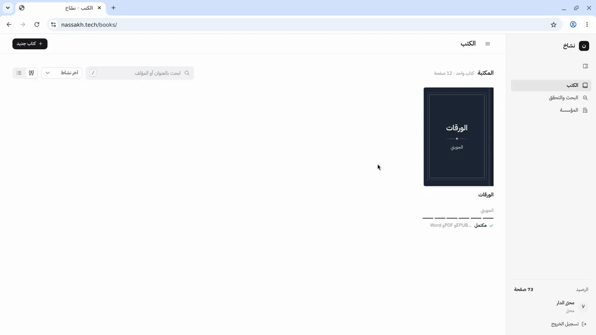
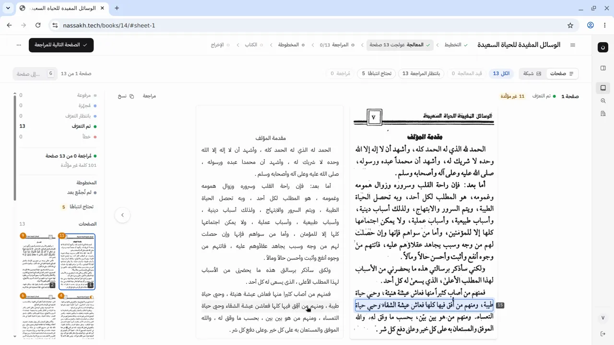
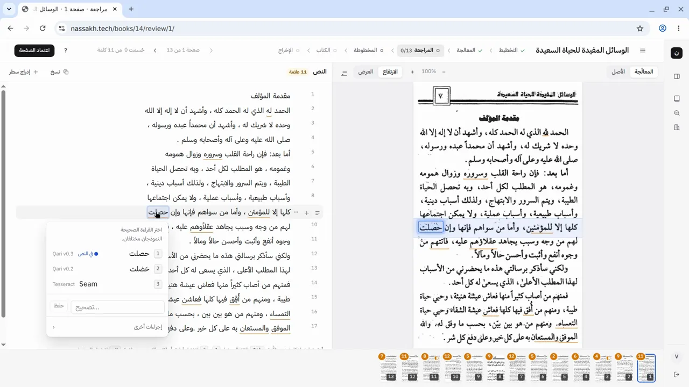
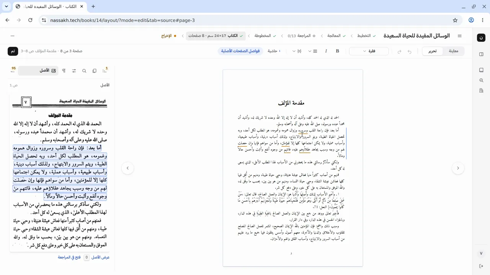
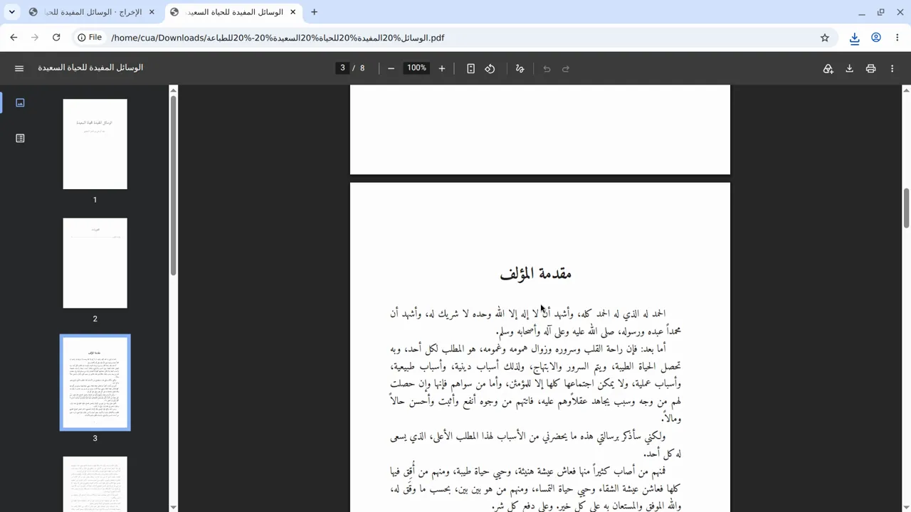
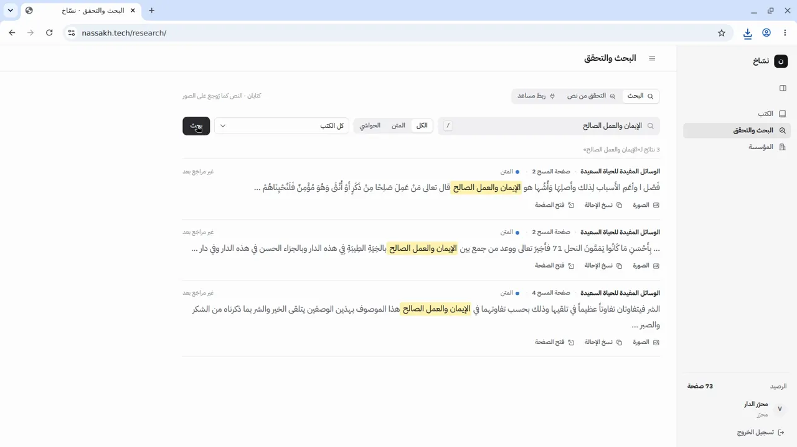
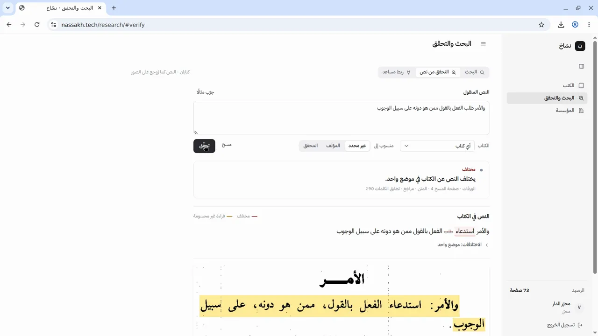
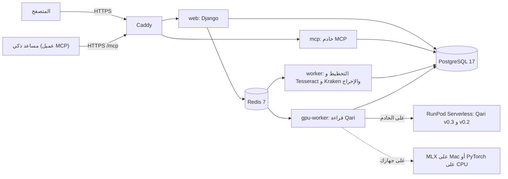

# نسّاخ (Nassakh)

نسّاخ يحوّل الكتاب العربي المطبوع الممسوح (PDF) إلى نص مراجَع، كل كلمة فيه مربوطة بموضعها في صورة الصفحة. الناشر يُخرج من هذا النص طبعة جديدة. الباحث والمساعد الذكي (AI assistant) يبحثان فيه، ويتحققان من الاقتباس، ويرجعان إلى الصفحة المطبوعة.

- **التحدي:** تحدي الذكاء الاصطناعي في خدمة المحتوى الإسلامي 2026، المسار 04: أدوات المعرفة والتحقق.
- **ما يُقيَّم:** ما بُني من 4 إلى 6 أكتوبر 2026. انظر [ما بُني في أيام التحدي](#ما-بني-في-أيام-التحدي).

## الموقع الحي، والفيديو، وحساب التجربة

| | |
|---|---|
| الموقع الحي | https://nassakh.tech |
| الفيديو (1:59) | [deliverables/nassakh-demo-video.mp4](deliverables/nassakh-demo-video.mp4) |
| العرض التقديمي | [deliverables/nassakh-presentation.pdf](deliverables/nassakh-presentation.pdf) |
| حساب التجربة: البريد | `video@nassakh.tech` |
| حساب التجربة: كلمة المرور | `Nk-yimxMr2D2tjv5g` |
| المؤسسة | «دار المخطوطات» |
| الرصيد | 100 صفحة، بقي منها 73 صفحة في 6 أكتوبر 2026. لا سحب على المكشوف. |
| الكتب | «الورقات» للجويني (مكتمل: مراجَع ومُخرَج)، و«الوسائل المفيدة للحياة السعيدة» (13 صفحة، مقروءة) |

> **تنبيه:** حساب التجربة مشترك بين الزوار والمحكّمين. لا تحذف كتابًا. يمكنك رفع كتاب صغير، والرفع محدود بالرصيد.

التجربة في 5 دقائق: [التجربة على الموقع الحي](#التجربة-على-الموقع-الحي). التشغيل على جهازك: [التشغيل على جهازك](#التشغيل-على-جهازك).

## المحتويات

1. [المشكلة](#المشكلة)
2. [ما الذي يفعله نسّاخ](#ما-الذي-يفعله-نسّاخ)
3. [صور من النظام](#صور-من-النظام)
4. [ما بُني في أيام التحدي](#ما-بني-في-أيام-التحدي)
5. [التجربة على الموقع الحي](#التجربة-على-الموقع-الحي)
6. [التسجيل والحصول على رصيد صفحات](#التسجيل-والحصول-على-رصيد-صفحات)
7. [التشغيل على جهازك](#التشغيل-على-جهازك)
8. [البنية والتقنيات](#البنية-والتقنيات)
9. [القياس والنتائج](#القياس-والنتائج)
10. [القيود المعروفة](#القيود-المعروفة)
11. [المصادر والحقوق](#المصادر-والحقوق)
12. [الترخيص](#الترخيص)
13. [الاختبارات](#الاختبارات)
14. [هيكل المستودع وخريطة الوثائق](#هيكل-المستودع-وخريطة-الوثائق)
15. [المصطلحات](#المصطلحات)
16. [English summary](#english-summary)
17. [التواصل](#التواصل)

## المشكلة

كتب إسلامية كثيرة ما زالت صورًا لا تُقرأ آليًا. هي كتب في الملك العام (public domain) لم تدخل المكتبات الرقمية، ولا توجد إلا صورًا ممسوحة لطبعات قديمة. تفريغها باليد يأخذ شهورًا، ولا يخلو من الخطأ. لذلك ينقل الباحثون والمساعدات الذكية منها بالواسطة أو من الذاكرة. والنتيجة اقتباسات محرّفة، وإحالات خاطئة، وكلام المحقق يُنسب إلى المؤلف.

نسّاخ سلسلة واحدة تخدم الطرفين. النص الذي يراجعه المختص ويطبعه الناشر هو النص الذي يبحث فيه الباحث ويستشهد به المساعد الذكي.

## ما الذي يفعله نسّاخ

### طرف الناشر: ست مراحل من الصورة إلى الطبعة

| المرحلة | ما يحدث فيها | الشفرة |
|---|---|---|
| التخطيط | تحديد آلي لمناطق الصفحة: المتن والحاشية ورقم الصفحة. المستخدم يعدّلها إن لزم. خط الترويسة (running head) يُحدَّد باليد. | `processing/` |
| المعالجة | نموذجا Qari v0.3 وv0.2 يقرآن كل منطقة. عند اختلافهما يُرجَّح بينهما، وتُعلَّم الكلمة بالشك. Tesseract وKraken يحددان مواضع الكلمات. Kraken يقرأ الأرقام وأرقام الحواشي. | `ocr/` |
| المراجعة | المختص يحسم كل كلمة مشكوك فيها أمام صورتها، ثم يعتمد الصفحة. | `review/` |
| المخطوطة | تجميع الكتاب آليًا: حذف الترويسات وأرقام الصفحات، ووصل الفقرات، وربط الحواشي بإحالاتها. ثم مراجعة الفقرات والفصول. | `assembly/`، `editor/` |
| الكتاب | تنسيق الطبعة الجديدة، والأصل المطبوع بجانبها. | `editor/` |
| الإخراج | PDF للمطبعة، وPDF للشاشة، وWord، وEPUB. | `publishing/` |

هذه المراحل الست من [نسخة البداية](docs/challenge/CHALLENGE_BASELINE.md). لم تُبنَ في أيام التحدي.

### طرف الباحث: البحث والتحقق من الاقتباس

صفحة «البحث والتحقق» تعمل على النص كما رُوجع على صورة الصفحة، لا على نص الطبعة المحرَّر. الشفرة في `research/`.

- **البحث:** في المتن، أو في الحواشي، أو فيهما. يتجاوز البحث فروق الرسم والتشكيل، مثل الهمزات والتاء المربوطة والحركات (التطبيع، normalisation).
- **التحقق من الاقتباس:** يقابل النص المنقول بنص الكتاب كلمةً كلمة. يعطي واحدًا من أربعة أجوبة:

| الجواب | المعنى |
|---|---|
| مطابق | النص كما في الكتاب. إذا اختلفت الحركات وحدها، يذكر ذلك ولا يعدّه خطأ. |
| مختلف | الفرق في كلمة مراجَعة أو مقروءة بثقة. يعرض كل فرق، وكلمة الكتاب بجانب كلمة النص المنقول. |
| يحتاج مطابقة مع الصورة | الفرق في كلمة لم تُحسم قراءتها بعد. قد يكون الخطأ في القراءة لا في الاقتباس. لا يصف النص بالتحريف، ويعرض صورة الأسطر. |
| لم يوجد | النص ليس في كتب الحساب. لا يقول إن النص مختلَق. |

- **الصفحة المطبوعة:** كل نتيجة تذكر رقم الصفحة في الطبعة المطبوعة إذا عُرف. إذا لم يُعرف، تذكر رقم صفحة المسح. ومعها رابط إلى صورة الأسطر، والموضع مظلَّل. الرابط موقَّع، ويعمل بلا تسجيل دخول مدة 7 أيام.
- **المؤلف أم المحقق:** المتن والحواشي مفهرسان كلٌّ على حدة. إذا نُسبت عبارة من الحاشية إلى المؤلف، ينبّه نسّاخ: «هذا من حاشية المحقق لا من متن المؤلف». والعكس كذلك.
- **الإحالة:** «نسخ الإحالة» يعطي إحالة جاهزة: المؤلف، والعنوان، والمحقق، والناشر، والطبعة، والسنة، والصفحة.

### خادم MCP (MCP server)

نسّاخ لا يضيف مساعد محادثة من عنده. أي مساعد ذكي يدعم بروتوكول MCP (Model Context Protocol) يتصل بخادم MCP في نسّاخ، ويقرأ كتب حسابه فقط. الشفرة في `research/mcp_server.py`.

| الأداة | ما تفعله |
|---|---|
| `list_books` | تعرض كتب الحساب: العنوان والمؤلف والمحقق والطبعة وعدد الصفحات ونسبة الأسطر المراجَعة. |
| `search` | تبحث في المتن أو الحواشي أو فيهما. |
| `get_passage` | تجلب المقطع: المتن والحواشي منفصلين، والصفحة المطبوعة، وحالة كل كلمة، ورابط صورة الأسطر. |
| `verify_quote` | تتحقق من الاقتباس، وتعطي أحد الأجوبة الأربعة، وتنبّه إلى خطأ النسبة. |
| `cite` | تبني الإحالة الموثّقة. |

- العنوان: `https://nassakh.tech/mcp`، بنقل Streamable HTTP.
- الأدوات للقراءة فقط. لا تغيّر شيئًا في الكتب.
- الدخول بمفتاح وصول (access key) يُنشأ من صفحة «ربط مساعد» ويُلغى منها. المفتاح يُرسل في ترويسة `Authorization: Bearer`، أو في رابط سري للعملاء الذين يقبلون رابطًا فقط.
- الحد: 60 استدعاء في الدقيقة لكل مفتاح. كل استدعاء يُسجَّل.
- صفحة «ربط مساعد» تعرض خطوات الربط لكل من: Claude (الموقع وتطبيق سطح المكتب)، وChatGPT، وClaude Code، وCursor، وVS Code، وأي عميل MCP آخر.
- جرّب المالك الربط من Claude وChatGPT في 6 أكتوبر 2026. يعمل.

## صور من النظام



*قائمة الكتب: كل كتاب ومرحلته وعدد صفحاته.*



*المعالجة: النص النهائي بعد قراءة النموذجين، بجانب صورة الصفحة.*



*المراجعة: الكلمة المشكوك فيها، وقراءات النماذج، وصورة موضعها في الصفحة.*



*التحرير: الفقرة في المخطوطة، وأصلها مظلَّل في صورة الصفحة المطبوعة.*



*الإخراج: الطبعة الجديدة بصيغة PDF مفتوحة في المتصفح.*



*البحث: النتائج مع الكتاب والصفحة المطبوعة وحالة الكلمات.*



*التحقق من الاقتباس: الجواب «مختلف»، وكلمة الكتاب بجانب كلمة النص المنقول.*

## ما بُني في أيام التحدي

بُني نسّاخ على مشروع سابق، كما يسمح البند 8 من شروط التحدي. وُثّقت نسخة البداية مساء 3 أكتوبر 2026 في [docs/challenge/CHALLENGE_BASELINE.md](docs/challenge/CHALLENGE_BASELINE.md)، وعليها الوسم (tag) `challenge-baseline-2026-10-03` (الإيداع `4ae7737`). كل إيداع بعد هذا الوسم هو عمل أيام التحدي: 25 إيداعًا حتى كتابة هذا الملف.

- الفرق كاملًا في git: [`challenge-baseline-2026-10-03...main`](../../compare/challenge-baseline-2026-10-03...main)، أو محليًا: `git log --oneline challenge-baseline-2026-10-03..HEAD`
- الشفرة عند نسخة البداية: [`challenge-baseline-2026-10-03`](../../tree/challenge-baseline-2026-10-03)
- مواصفة العمل: [docs/challenge/CHALLENGE_SPEC.md](docs/challenge/CHALLENGE_SPEC.md). القرارات: D106 إلى D112 في [docs/DECISIONS.md](docs/DECISIONS.md).

| الجزء | نسخة البداية (قبل 4 أكتوبر) | أيام التحدي (4 إلى 6 أكتوبر) | الشفرة |
|---|---|---|---|
| قراءة الكتاب وإخراجه | المراحل الست كاملة: التخطيط، والمعالجة، والمراجعة، والمخطوطة، والكتاب، والإخراج | لم تتغيّر | `processing/`، `ocr/`، `review/`، `assembly/`، `editor/`، `publishing/` |
| الحسابات | مؤسسات فقط، تُنشأ من لوحة الإدارة. كل كتاب لا يراه إلا أعضاء مؤسسته | تسجيل مفتوح لمؤسسة أو لفرد، وتأكيد بالبريد، والبريد اسم الدخول (D106) | `accounts/views.py`، `accounts/forms.py`، `templates/accounts/` |
| رصيد الصفحات | لا يوجد | رصيد صفحات لكل حساب، وباقات، ومنح لها تاريخ انتهاء، وسجل حركة لا يُعدَّل، وحد سحب على المكشوف تضبطه الإدارة، وصفحة «الفوترة» (D106) | `accounts/billing.py`، `accounts/models.py` |
| البحث | لا يوجد | بحث في المتن والحواشي مع تطبيع عربي، وفهرس يتجدد مع كل مراجعة (D107) | `research/services.py`، `research/indexing.py` |
| التحقق من الاقتباس | لا يوجد | الأجوبة الأربعة، والفروق كلمةً كلمة، وتنبيه النسبة إلى المؤلف أو المحقق (D107) | `research/services.py` |
| الصفحة المطبوعة والإحالة | لا يوجد | رقم الصفحة المطبوعة، ورابط موقَّع لصورة الأسطر، والإحالة الجاهزة (D107) | `research/` |
| صفحة «البحث والتحقق» | لا توجد | البحث، والتحقق من نص مع «جرّب مثالًا»، وربط مساعد (D107) | `research/views.py`، `templates/research/` |
| خادم MCP | لا يوجد | خمس أدوات للقراءة فقط، ومفاتيح وصول، ورابط سري، وحد للاستدعاءات (D108) | `research/mcp_server.py`، `research/mcp_auth.py` |
| التشغيل | على جهاز Mac للمطوّر. النماذج على Mac أو على RunPod | خادم عام بـ Docker Compose وCaddy وHTTPS على https://nassakh.tech، ونسخ احتياطي ليلي، ومراقبة كل 5 دقائق (D111) | `Dockerfile`، `docker-compose.yml`، `deploy/` |
| كتب التجربة | على جهاز المطوّر | نقل الكتب المقروءة بين قواعد البيانات حزمةً واحدة (D110)، وحساب تجربة عام | `books/management/commands/` |
| صفحة التعريف | لا توجد | صفحة عامة على `/` | `core/`، `templates/landing/` |
| القياس | لا قياس للتحقق من الاقتباس | `manage.py research_eval`، ومقارنة بالبحث الحرفي (Ctrl+F)، ونتائج منشورة (D112) | `research/evaluation.py`، `research/eval_report.py` |
| التشغيل على جهازك | دليل تطوير على Mac فقط | طريقان مجرَّبان: Mac مع MLX، وDocker على المعالج (CPU)، وكتاب عيّنة | `docs/RUN_LOCALLY.md`، `docker-compose.local.yml`، `samples/` |
| التوثيق | وثائق التطوير الداخلية | هذا الملف، وأدلة التشغيل، وسجل التراخيص والمصادر | `docs/` |

أسماء الملفات في عمود «الشفرة» إرشادية. القائمة الكاملة في الفرق بين الوسم و`main`.

## التجربة على الموقع الحي

افتح **https://nassakh.tech**، واضغط «تسجيل الدخول»، وأدخل بريد حساب التجربة وكلمة مروره ([أعلاه](#الموقع-الحي-والفيديو-وحساب-التجربة)).

**طرف الناشر (دقيقتان):**

1. افتح كتاب «الورقات» من قائمة الكتب.
2. اختر «المراجعة» من شريط المراحل في أعلى الصفحة. اضغط كلمة مسطَّرة لترى قراءات النماذج وصورة موضعها.
3. اختر «الإخراج» لترى ملفات الطبعة الجاهزة: PDF وWord وEPUB.

**طرف الباحث (دقيقتان):**

4. افتح «البحث والتحقق» من الشريط الجانبي.
5. في «البحث» اكتب: «الإيمان والعمل الصالح»، واضغط «بحث». تظهر 3 نتائج من «الوسائل المفيدة للحياة السعيدة»، مع الصفحة المطبوعة ورابط صورة الأسطر.
6. افتح «التحقق من نص»، والصق هذه العبارة، واضغط «تحقّق». الجواب «مطابق»:

   > والأمر استدعاء الفعل بالقول ممن هو دونه على سبيل الوجوب

7. الصق هذه العبارة بدلًا منها («طلب» بدل «استدعاء»). الجواب «مختلف»، ومعه موضع الكلمة، وكلمة الكتاب بجانبها:

   > والأمر طلب الفعل بالقول ممن هو دونه على سبيل الوجوب

8. اضغط «فتح الصورة» لترى الأسطر في الصفحة المطبوعة، والموضع مظلَّلًا.

**ربط مساعد ذكي (دقيقة واحدة، ثم بحسب العميل):**

> **تنبيه:** المفتاح يظهر مرة واحدة فقط. الرابط السري يعمل عمل كلمة المرور. لا تنشره.

9. افتح «ربط مساعد» في صفحة «البحث والتحقق».
10. اكتب اسمًا للاتصال، واضغط «إنشاء المفتاح».
11. اختر عميلك (Claude، أو ChatGPT، أو غيرهما)، واتبع الخطوات المعروضة.
12. اسأل المساعد: «ما الكتب في حسابي في نسّاخ؟»، ثم اطلب منه التحقق من إحدى العبارتين أعلاه.

العبارتان والبحث جُرّبت على الموقع الحي في 6 أكتوبر 2026.

## التسجيل والحصول على رصيد صفحات

- التسجيل مفتوح لأي شخص على https://nassakh.tech، مؤسسةً أو فردًا. الحساب يعمل بعد تأكيد البريد.
- الحساب الجديد يبدأ برصيد 0 صفحة. لا يستطيع معالجة كتاب حتى يحصل على رصيد.
- للحصول على رصيد صفحات: افتح مسألة (issue) في [GitHub Issues](../../issues) في هذا المستودع، واذكر بريد حسابك وعدد الصفحات التي تحتاجها. الفريق يمنح الصفحات من لوحة «الفوترة». لا دفع إلكتروني.
- البحث والتحقق وخادم MCP لا تستهلك الرصيد. الرصيد يُستهلك عند معالجة الصفحات فقط.

## التشغيل على جهازك

لتشغيل نسّاخ على جهازك طريقان. كلاهما يقرأ الصفحات بالنموذجين نفسيهما: Qari v0.3 وQari v0.2. الخطوات الكاملة المجرَّبة، مع حل المشكلات، في [docs/RUN_LOCALLY.md](docs/RUN_LOCALLY.md).

كتاب العيّنة: [samples/alwaraqat-sample.pdf](samples/alwaraqat-sample.pdf). هو صفحتان من أول «الورقات» للجويني، نص في الملك العام. صور الصفحتين مولَّدة بشكل المسح، وليست مسحًا حقيقيًا ([samples/README.md](samples/README.md)).

| | (أ) Mac بمعالج Apple Silicon مع MLX | (ب) أي حاسوب مع Docker على المعالج (CPU) |
|---|---|---|
| الجهاز | Mac بشريحة M1 أو أحدث | Linux، أو Windows، أو Mac بمعالج Intel، مع Docker |
| تشغيل النماذج | MLX على المعالج الرسومي في Mac (`OCR_BACKEND=mlx`) | PyTorch على المعالج (CPU) داخل حاوية (container) (`OCR_BACKEND=torch`) |
| الذاكرة (RAM) | 16 GB أو أكثر (جُرّب على 24 GB) | 16 GB أو أكثر، منها 12 GB لـ Docker |
| مساحة القرص | نحو 25 GB | نحو 20 GB |
| التنزيل | 9 GB للنماذج، ونحو 1.5 GB لحزم Python | 9 GB للنماذج، ونحو 2 GB للصور (images) |
| زمن الصفحة | نحو 20 ثانية (الصفحة الأولى حتى دقيقتين) | نحو 6 إلى 8 دقائق على نواتين (تقدير) |
| حالة التجربة | جُرّب كاملًا في 6 أكتوبر 2026 | جُرّب بناء الصورة، وتنزيل النماذج، وقراءة صفحة. لم يُجرَّب تشغيل الخدمات كلها معًا |

**(أ) Mac مع MLX، باختصار:**

```sh
brew install uv redis tesseract tesseract-lang postgresql@17
brew services start postgresql@17 && brew services start redis
git clone <repository URL> nassakh && cd nassakh
uv venv --python 3.13 .venv
uv pip install --python .venv/bin/python -r pyproject.toml --extra dev --extra mlx
make kraken                                   # Kraken in its own Python 3.11 environment
cp .env.example .env                          # then set SECRET_KEY, DATABASE_URL, OCR_BACKEND=mlx, OCR_MODELS_DIR=models/qari
make db
.venv/bin/python manage.py prepare_models --mlx   # 9 GB
make web && make worker && make gpu-worker    # three terminals
make superuser
```

**(ب) Docker على المعالج، باختصار:**

```sh
git clone <repository URL> nassakh && cd nassakh
cp deploy/.env.local.example deploy/.env.local   # then set SECRET_KEY
docker compose -f docker-compose.local.yml build
docker compose -f docker-compose.local.yml run --rm --no-deps gpu-worker python manage.py prepare_models
docker compose -f docker-compose.local.yml up -d
docker compose -f docker-compose.local.yml exec web python manage.py createsuperuser
```

ثم افتح http://127.0.0.1:8000 (الطريق أ) أو http://localhost:8000 (الطريق ب)، وارفع كتاب العيّنة، واضغط «استخراج الصفحات»، ثم «بدء المعالجة».

> **تنبيه:** القراءة على المعالج (CPU) بطيئة. جرّب كتاب العيّنة أولًا، لا كتابًا كاملًا.
>
> **تنبيه:** الخادم العام يستعمل طريقًا ثالثًا هو `OCR_BACKEND=runpod`. هذا الطريق يحتاج عامل GPU (RunPod worker) ليس في هذا المستودع. لا تستعمله على جهازك.

## البنية والتقنيات



| المكوّن | الاستعمال |
|---|---|
| Django 6.1 وDjango REST framework | التطبيق والواجهات البرمجية (API) |
| Celery مع Redis | طوابير المهام (task queues): `default` و`layout` و`export` على المعالج، و`gpu` لقراءة النماذج |
| PostgreSQL 17 | قاعدة البيانات، مع فهرس `pg_trgm` للبحث |
| Qari-OCR v0.3 وv0.2 (NAMAA) على Qwen2-VL-2B-Instruct | قراءة الصفحة، والترجيح بين النموذجين |
| Tesseract 5 (العربية) | مواضع الكلمات، وقراءة احتياطية |
| Kraken مع نموذج `all_arabic_scripts` من OpenITI | الأرقام، وأرقام الحواشي، ومواضع الكلمات في الأسطر |
| MLX-VLM أو PyTorch | تشغيل نموذجَي Qari على الجهاز المحلي |
| RapidFuzz | المطابقة التقريبية في البحث |
| MCP Python SDK (الحزمة الرسمية `mcp`) | خادم MCP بنقل Streamable HTTP |
| PyMuPDF | قراءة ملفات PDF المرفوعة واستخراج الصفحات |
| WeasyPrint وpython-docx وEbookLib | إخراج PDF وWord وEPUB |
| Alpine.js وTailwind CSS وTiptap | الواجهة والمحرّر |
| Node.js (وقت البناء فقط) | `package.json` يبني CSS بـ Tailwind، وحزمة المحرّر Tiptap بـ esbuild، وينسخ Alpine.js والخطوط (`npm run build`، في `Dockerfile` و`Makefile`). Node غير مطلوب عند التشغيل. |

**التشغيل على الخادم العام** ([docs/DEPLOY.md](docs/DEPLOY.md)، [تقرير النشر](docs/challenge/DEPLOY_REPORT_2026-10-05.md)):

- خادم افتراضي واحد (VPS): 4 معالجات افتراضية، وذاكرة 16 GB، ونظام Ubuntu.
- Docker Compose يشغّل: `caddy`، و`web`، و`worker`، و`gpu-worker`، و`mcp`، و`postgres`، و`redis`. الملف: [docker-compose.yml](docker-compose.yml).
- Caddy يقدّم HTTPS بشهادة Let's Encrypt. لا يكتب الرابط السري لخادم MCP في السجلات.
- قراءة النماذج على RunPod Serverless بمعالج رسومي (GPU) سعة 24 GB. في اختبار النشر قُرئت 114 صفحة بلا أي استدعاء فاشل.
- عامل RunPod (RunPod worker) الذي يشغّل النموذجين ليس جزءًا من هذا المستودع.
- نسخة احتياطية ليلية لقاعدة البيانات. ومراقبة (watchdog) كل 5 دقائق تعيد تشغيل الخدمة المتوقفة.

## القياس والنتائج

قسنا أداة التحقق من الاقتباس على ثلاثة كتب مقروءة في حساب قياس منفصل عن حساب التجربة: 569 صفحة، و82,788 كلمة. صنعنا 1,980 عبارة في 11 صنفًا، بثلاث بذور (seeds) عشوائية، ثم 2,340 عبارة أخرى لفحص الطول ودرجة التغيير. البديل المسمّى هو البحث الحرفي في النص الخام، أي ما يفعله Ctrl+F في ملف PDF.

| ما قيس (عبارات من 8 إلى 14 كلمة) | نسّاخ | البحث الحرفي (Ctrl+F) | حدود النتيجة |
|---|---|---|---|
| عبارة صحيحة مكتوبة بإملاء الناس (بلا تشكيل، و«أ» «ا»، و«ة» «ه»): قُبلت | 100% | 0% | العبارات مقصوصة من نص OCR نفسه، فالقبول صحيح بحكم الصنع إلى حد كبير. |
| كلمة مبدَّلة أو محذوفة أو مقدَّمة: كُشفت وحُدّد موضعها | 100% | يقول «لم يوجد» ولا يحدد الموضع | التعديلات اصطناعية. إذا تبدّلت 4 كلمات، يقول نسّاخ «لم يوجد» في 32% من الحالات. |
| حاشية نُسبت إلى المؤلف، أو متن نُسب إلى المحقق: كُشفت النسبة | 100% | 0% | ثلاثة كتب فقط، بخط مطبوع متقارب. |
| عبارة صحيحة اختلفت عند كلمة مشكوك فيها: اتُّهمت بالتحريف (الأقل أفضل) | 0.6% | 100% | الصنف مبني على الصنع. أثره في الاقتباس الحقيقي غير مقيس. |
| عبارة ليست في الكتب: الجواب «لم يوجد» | 99.4% | 100% | نسّاخ أضعف هنا. في العبارات من 4 أو 5 كلمات: 93.9%. |

- **التكرار:** أعدنا البذرة الأولى. الأجوبة متطابقة في 1,440 من 1,440 عبارة.
- **السرعة:** الوسيط 44 ms، والمئين 95 هو 111 ms، على جهاز التطوير.
- **لا مجموعة موسومة باليد.** لم نقارن ببحث بالتضمين (embeddings) ولا بنموذج لغوي يُسأل عن الاقتباس.

الجداول الكاملة والإخفاقات وكل الحدود: [docs/challenge/CHALLENGE_RESULTS.md](docs/challenge/CHALLENGE_RESULTS.md). المنهجية: D112 في [docs/DECISIONS.md](docs/DECISIONS.md).

لإعادة القياس على كتب مقروءة في قاعدة بياناتك (ضع أرقام كتبك):

```sh
.venv/bin/python manage.py research_eval --books 29 31 41 --absent-books 33 34 35 36 37 38 \
    --seeds 3 --n 60 --out docs/challenge/CHALLENGE_RESULTS.md --json /tmp/research_eval.json
```

الأمر لا يغيّر البيانات. يعمل داخل معاملة (transaction) تُلغى عند الانتهاء. البذرة نفسها تعطي العبارات نفسها.

## القيود المعروفة

**القراءة (OCR)**

- تبقى أخطاء في المسح الرديء وفي النص المشكول. في كتاب حديث مشكول: 3.9% من الكلمات فيها خطأ في حرف، و3.9% خطأ في حركة (صفحتان قيستا باليد).
- خطأ الحركة لا يُعلَّم بالشك إذا اتفق النموذجان عليه.
- الألف الخنجرية تُقرأ أحيانًا نونًا («هنذا» بدل «هَـٰذَا»)، وألف الوصل تُقرأ همزة.
- خط الترويسة (running head) يُحدَّد باليد في مرحلة «التخطيط». الكشف الآلي عنه عمل قادم.
- ربط الحواشي بإحالاتها: 157 من 166 إحالة صحيحة في كتب الضبط العشرة. النسبة أقل في الكتب الجديدة وفي المسح الرديء.
- الجداول غير مدعومة. صور المخطوطات داخل الكتاب تُقرأ نصًا لا معنى له، ويجب استبعادها يدويًا.
- القراءة على المعالج (CPU) بطيئة: نحو 3 دقائق لقراءة صفحة بنموذج واحد على نواتين، ونحو 6 إلى 8 دقائق للصفحة كاملة (تقدير). تشغيل الخدمات كلها بـ Docker على المعالج لم يُجرَّب معًا بعد.

**التحقق من الاقتباس**

- الرمز «ﷺ» يُعامَل كلمة واحدة. اقتباس يكتب «صلى الله عليه وسلم» كاملة لا يطابق موضعًا فيه الرمز، والعكس.
- خطأ OCR لم يُعلَّم بالشك يظهر للأداة اختلافًا، فيكون الجواب «مختلف» لعبارة صحيحة.
- العبارة القصيرة (4 أو 5 كلمات) قد تُنسب إلى مقطع قريب، مثل سلاسل الإسناد والأسماء.
- عتبة تطابق الكلمات 0.6. إذا تبدّلت 4 كلمات في عبارة من 8 إلى 14 كلمة، يكون الجواب «لم يوجد» في 32% من الحالات.
- البحث في كتب الحساب فقط.

**الحسابات والتشغيل**

- تأكيد البريد مطلوب قبل الدخول.
- الحساب الجديد يبدأ برصيد 0 صفحة. لا دفع إلكتروني: الإدارة تمنح الصفحات يدويًا.
- لا دعوة أعضاء إلى المؤسسة بعد.
- الدخول إلى خادم MCP بمفتاح وصول. لا يوجد OAuth.
- رابط صورة الأسطر ينتهي بعد 7 أيام. ابحث مرة أخرى للحصول على رابط جديد.
- رقم الصفحة المطبوعة يُستنتج من قراءة رقم الصفحة. إذا لم يُقرأ (مثلًا رقم داخل إطار)، تُذكر صفحة المسح بدلًا منه.
- لا حقل لحالة حقوق الكتاب بعد، ولا فتح للكتب للعموم.
- الخادم اختُبر بمستخدم واحد وستة كتب معًا. لم يُختبر الحمل العالي.

## المصادر والحقوق

**الموثوقية**

- لكل كلمة حالة: مراجَعة، أو آلية (غير مراجَعة)، أو مشكوك فيها. البحث والتحقق وأدوات MCP تُرجع هذه الحالة.
- المراجعة بشرية: المختص يحسم الكلمات المشكوك فيها أمام صورتها، ثم يعتمد الصفحة.
- قاعدة «يحتاج مطابقة مع الصورة»: إذا وقع الفرق على كلمة لم تُحسم قراءتها، لا يحكم نسّاخ بالتحريف. يعرض صورة الأسطر ليحكم القارئ.
- «لم يوجد» تعني أن النص ليس في كتب الحساب. لا تعني أنه مختلَق.
- كل جواب يحيل إلى الصفحة المطبوعة وصورة أسطرها.
- تعليمات خادم MCP تطلب من المساعد ذكر الصفحة المطبوعة ورابط الصورة، وفصل المتن عن الحواشي.

**الحقوق**

- لا مكتبة عامة في نسّاخ. كل كتاب في حساب مؤسسة أو فرد، ولا يراه غير أعضائه.
- المساعد الذكي لا يقرأ إلا كتب الحساب الذي أنشأ مفتاحه.
- قاعدة المنصة: لا يُتاح للعموم إلا ما خرج إلى الملك العام. في هذه النسخة لا يُتاح أي كتاب للعموم.
- متن المؤلف منفصل عن حواشي المحقق في الفهرس وفي كل جواب. حواشي محقق حديث قد تكون محمية.
- من يرفع كتابًا مسؤول عن حقه في معالجته.
- كتاب حساب التجربة «الورقات» للجويني (المتوفى 478 هـ) نص في الملك العام.

**المصادر والإفصاح**

- المحتوى والمصادر، وطريقة التحقق من النص، ومجموعة القياس: [docs/SOURCES.md](docs/SOURCES.md).
- المكوّنات والنماذج والخدمات الخارجية ورخصها: [docs/THIRD_PARTY_LICENSES.md](docs/THIRD_PARTY_LICENSES.md).
- عبارات القياس مصنوعة آليًا من نص الكتب. لا بيانات شخصية فيها.
- بُني نسّاخ بمساعدة أداة البرمجة Claude Code.

## الترخيص

- شفرة نسّاخ متاحة للاطلاع والتقييم (source-available)، وجميع الحقوق محفوظة. النص المعتمد في [LICENSE](LICENSE).
- يجوز قراءة الشفرة وتشغيلها على جهازك أو على خادم تجربة، للتقييم والمراجعة والتعلّم.
- الاستعمال التجاري، وتقديم نسّاخ خدمةً مستضافة لغيرك، وإعادة نشر الشفرة: كلها تحتاج إذنًا مكتوبًا.
- مكتبتان من المكتبات المستعملة برخصة AGPL-3.0: PyMuPDF لقراءة ملفات PDF، وEbookLib لإخراج EPUB. تعمل بهما هذه النسخة والموقع الحي. وسنستبدلهما قبل أي خدمة تجارية مغلقة: pypdfium2 (Apache-2.0 / BSD-3) بدل PyMuPDF، ومولّد EPUB خاص بنسّاخ بدل EbookLib.
- المكوّنات والنماذج الخارجية الأخرى تبقى تحت رخصها: [docs/THIRD_PARTY_LICENSES.md](docs/THIRD_PARTY_LICENSES.md).

## الاختبارات

```sh
make test                       # = .venv/bin/pytest (settings: nassakh.settings_test)
make lint                       # ruff check and ruff format --check
```

- عدد الاختبارات: 2,078 اختبارًا في 62 ملفًا. شُغّلت كلها في 6 أكتوبر 2026 بلا إخفاق.
- اختبارات البحث والتحقق وخادم MCP في `research/test_*.py`. منها اختبار المقطع العابر بين صفحتين.
- قياس التحقق من الاقتباس: `manage.py research_eval`. انظر [القياس والنتائج](#القياس-والنتائج).

## هيكل المستودع وخريطة الوثائق

```text
accounts/     الحسابات، والتسجيل، ورصيد الصفحات، و«الفوترة» (D106)
books/        الكتب والصفحات، والرفع، وحزم كتب التجربة (D110)
processing/   مرحلة «التخطيط»: تجهيز الصفحة ومناطقها
ocr/          مرحلة «المعالجة»: Qari وTesseract وKraken وعميل RunPod
review/       مرحلة «المراجعة»
assembly/     تجميع المخطوطة، وربط الحواشي بإحالاتها
editor/       المخطوطة، والمحرّر، وتنسيق الكتاب
publishing/   الإخراج: PDF وWord وEPUB
research/     البحث، والتحقق من الاقتباس، وخادم MCP، والقياس (D107، D108، D112)
core/         أدوات مشتركة، وصفحة التعريف
nassakh/      إعدادات Django وCelery
templates/    قوالب الصفحات
static/       الأنماط والخطوط وصور صفحة التعريف
scripts/      بناء حزمة المحرّر، ونسخ مكتبات الواجهة، وصنع كتاب العيّنة
deploy/       إعداد الخادم، والنشر، والنسخ الاحتياطي، والمراقبة
docs/         الوثائق (انظر الخريطة أدناه)
playground/   تجارب القياس والنماذج الأولية (PoC)
samples/      كتاب العيّنة للتشغيل المحلي
deliverables/ مخرجات التسليم: فيديو العرض، والعرض التقديمي (PDF وPPTX)
```

**خريطة الوثائق.** الفهرس الكامل في [docs/README.md](docs/README.md). الوثائق في ثلاث مجموعات:

| المجموعة | الملفات |
|---|---|
| عام (`docs/`) | [RUN_LOCALLY.md](docs/RUN_LOCALLY.md) التشغيل على جهازك. [DEPLOY.md](docs/DEPLOY.md) النشر على خادم. [RUNBOOK.md](docs/RUNBOOK.md) دليل التطوير على Mac. [DECISIONS.md](docs/DECISIONS.md) سجل القرارات D1 إلى D112. [SOURCES.md](docs/SOURCES.md) المحتوى والمصادر والحقوق. [THIRD_PARTY_LICENSES.md](docs/THIRD_PARTY_LICENSES.md) رخص المكوّنات. |
| أعمال التحدي (`docs/challenge/`) | [CHALLENGE_BASELINE.md](docs/challenge/CHALLENGE_BASELINE.md) نسخة البداية قبل التحدي. [CHALLENGE_SPEC.md](docs/challenge/CHALLENGE_SPEC.md) مواصفة عمل أيام التحدي. [CHALLENGE_RESULTS.md](docs/challenge/CHALLENGE_RESULTS.md) نتائج القياس وحدوده. [DEPLOY_REPORT_2026-10-05.md](docs/challenge/DEPLOY_REPORT_2026-10-05.md) تقرير النشر. [DEMO_DATA.md](docs/challenge/DEMO_DATA.md) نقل كتب التجربة إلى الخادم. |
| نسخة البداية (`docs/baseline/`) | مواصفات المراحل وخططها وتقارير اختبارها قبل 4 أكتوبر 2026، مثل [PLAN.md](docs/baseline/PLAN.md) و[PHASE7_SPEC.md](docs/baseline/PHASE7_SPEC.md). |

## المصطلحات

| العربية | English |
|---|---|
| التعرّف الضوئي على الحروف | OCR |
| المتن | body text (the author's text) |
| الحاشية | footnote (the editor's note) |
| المحقق | editor of a critical edition |
| الكلمة المشكوك فيها | doubtful word (flagged by OCR) |
| الكلمة المراجَعة | reviewed word |
| التخطيط | layout (stage 1) |
| الترويسة | running head |
| المعالجة | model reading, OCR (stage 2) |
| المراجعة | review (stage 3) |
| المخطوطة | manuscript, the assembled text (stage 4) |
| الإخراج | export (stage 6) |
| الصفحة المطبوعة | printed page (its number in the printed edition) |
| صورة الأسطر | page clip (the lines, highlighted) |
| الإحالة | citation |
| التطبيع | normalisation |
| خادم MCP | MCP server |
| مساعد ذكي | AI assistant (an MCP client) |
| مفتاح الوصول | access key |
| رصيد الصفحات | page credit (quota) |
| حاوية | container |
| طابور المهام | task queue |
| الملك العام | public domain |
| نسخة البداية | baseline |

## English summary

Nassakh turns scanned printed Arabic books (PDF) into reviewed text. Every word is linked to its place on the page image. Publishers export a new edition from that text. Researchers and AI assistants search it, check quotations and go back to the printed page.

- **Live site:** https://nassakh.tech. Test account: `video@nassakh.tech`, password `Nk-yimxMr2D2tjv5g` (shared; please do not delete the books). Video: [deliverables/nassakh-demo-video.mp4](deliverables/nassakh-demo-video.mp4). Slides: [deliverables/nassakh-presentation.pdf](deliverables/nassakh-presentation.pdf).
- **Built before the challenge** (tag `challenge-baseline-2026-10-03`, commit `4ae7737`, [docs/challenge/CHALLENGE_BASELINE.md](docs/challenge/CHALLENGE_BASELINE.md)): the six stages from scan to book (layout, OCR with Qari v0.3 and v0.2 on Qwen2-VL plus Tesseract and Kraken, human review, assembly, book layout, export to print PDF, screen PDF, Word and EPUB).
- **Built on 4 to 6 October 2026** (25 commits after the tag): open sign-up for organisations and individuals with email confirmation and admin-managed page credits (`accounts/`); search and quotation checking over the reviewed text with four answers (exact, differs, needs image check, not found), the printed page and a signed link to the highlighted lines, and a warning when an editor's note is attributed to the author (`research/`); a read-only MCP server with five tools (`research/mcp_server.py`), tested with Claude and ChatGPT; deployment with Docker Compose on one VPS (`deploy/`); an evaluation against plain substring search; a landing page; two verified local-run paths.
- **Results** ([docs/challenge/CHALLENGE_RESULTS.md](docs/challenge/CHALLENGE_RESULTS.md)): on three books (569 pages), correctly retyped quotations accepted 100% (Ctrl+F: 0%); altered words found and located 100%; misattribution caught 100%; false accusation at doubtful OCR readings 0.6% (100% without that feature); unrelated text answered "not found" 99.4% (Ctrl+F: 100%). Limits: synthetic quotations cut from the same OCR text, three books, no human-labelled set.
- **New accounts** start with 0 pages. To get page credits, open a GitHub Issue in this repository.
- **Run it yourself:** a Mac with Apple Silicon (MLX) or any computer with Docker on the CPU. See [docs/RUN_LOCALLY.md](docs/RUN_LOCALLY.md) and the sample book [samples/alwaraqat-sample.pdf](samples/alwaraqat-sample.pdf).
- **Licence:** source-available, all rights reserved ([LICENSE](LICENSE)). Two dependencies are AGPL-3.0: PyMuPDF (reading PDF) and EbookLib (EPUB output); this version, including the live site, uses them, and they will be replaced before any closed commercial service. Third-party licences: [docs/THIRD_PARTY_LICENSES.md](docs/THIRD_PARTY_LICENSES.md). Sources: [docs/SOURCES.md](docs/SOURCES.md).

## التواصل

للأسئلة والملاحظات وطلب رصيد الصفحات، افتح مسألة (issue) في [GitHub Issues](../../issues).
